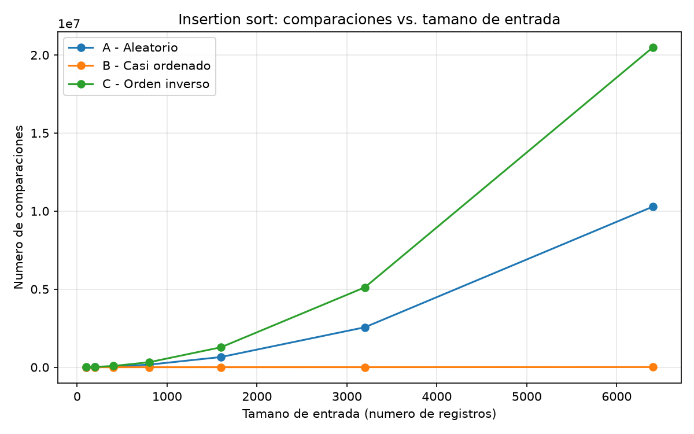
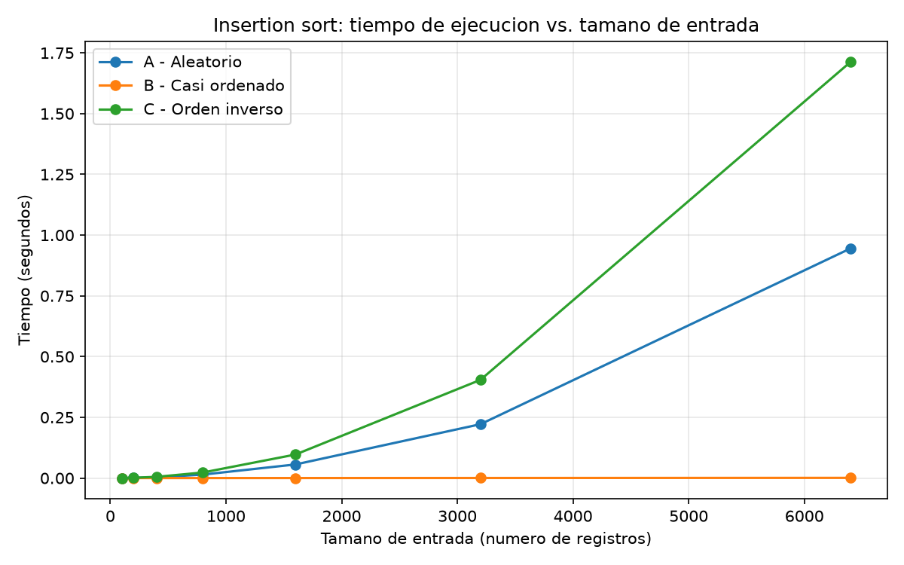
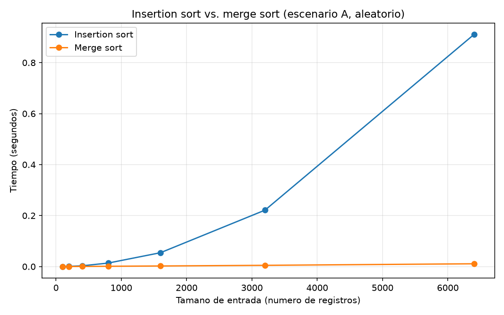

# Laboratorio evaluativo 01 — Fundamentos, complejidad y recurrencias

**Nombre:** Sebastián Jesús Pérez Araujo
**Curso:** Análisis de Algoritmos

## Instrucciones para reproducir el experimento

Estos pasos se corren desde la raíz del repositorio (`curso-analisis-algoritmos/`). El entorno virtual (`venv/`) ya existe ahí; solo hay que activarlo.

### 1. Activar el entorno virtual

Elige el comando según tu sistema operativo y terminal:

**Linux / macOS (bash o zsh):**
```bash
source venv/bin/activate
```

**Linux / macOS (fish):**
```bash
source venv/bin/activate.fish
```

**Windows (PowerShell):**
```powershell
venv\Scripts\Activate.ps1
```

**Windows (cmd):**
```cmd
venv\Scripts\activate.bat
```

Si todo salió bien, la terminal muestra el prefijo `(venv)` antes del prompt.

### 2. Instalar las dependencias (solo la primera vez)

```bash
pip install -r requirements.txt
```

### 3. Entrar a la carpeta del laboratorio

```bash
cd lab1-fundamentos-complejidad-recurrencias
```

### 4. Ejecutar los experimentos

```bash
# Parte 3: mide insertion sort en los tres escenarios y guarda
# graficas/parte3_comparaciones.png y graficas/parte3_tiempo.png
python3 parte3_casos.py

# Parte 4: compara insertion sort contra merge sort y guarda
# graficas/parte4_tiempo.png
python3 parte4_complejidad.py
```

En Windows, si `python3` no es reconocido, usa `python` en su lugar.

Cada script va imprimiendo en la terminal el tiempo y el número de comparaciones que midió para cada escenario o algoritmo, antes de guardar las gráficas al final.

---

## Parte 1 — Analizar el algoritmo antes de comprar hardware

El hecho de que insertion sort haya funcionado durante varios años no significa que siga siendo adecuado para cualquier cantidad de información. Mientras Tamiza trabajaba con los datos de los primeros municipios, el algoritmo podía cumplir su función sin que el tiempo de ejecución fuera un problema tan grande. Ahora la situación cambió porque el sistema debe procesar aproximadamente 1.200.000 registros.

Aquí hay que separar dos cosas. Por un lado está el resultado: insertion sort ordena correctamente los registros. Por otro está el tiempo necesario para obtener ese resultado. En este momento el inconveniente está en lo segundo, porque el procesamiento debe terminar entre las 2:00 a. m. y las 6:00 a. m.

Insertion sort tiene un comportamiento Θ(n²) en los casos promedio y peor. Tamiza pasó de unos 20.000 registros a cerca de 1.200.000, es decir, aproximadamente 60 veces más información. Debido al crecimiento cuadrático, el trabajo podría aumentar alrededor de 60² = 3.600 veces.

Esto también lo puedo relacionar con mi experiencia desarrollando software en Python. Por ejemplo, en Fast 6.2 trabajé en la automatización de un proceso que organizaba y analizaba millones de registros de bases de datos y sistemas operativos para los analistas de Tigo. Antes de automatizarlo, revisar esos registros le tomaba a un analista alrededor de tres días, lo que representaba un costo real en horas de trabajo que la empresa pagaba por una tarea repetitiva. El objetivo fue reducir ese proceso a unos minutos, liberando ese tiempo de los analistas para otras tareas y bajando el costo asociado. Aunque el problema de Fast 6.2 es diferente al de Tamiza, ambos muestran que cuando se procesa una cantidad considerable de información no basta con que el programa entregue el resultado correcto; también importa cuánto tiempo necesita para hacerlo.

Por eso, aumentar únicamente la velocidad del servidor no solucionaría el problema de fondo. Incluso si el equipo fuera dos veces más rápido, la mejora sería de 2 veces contra el crecimiento producido por pasar de 20.000 a 1.200.000 registros (3600 veces).

Eso es lo que ocurre con insertion sort en Tamiza. El problema no es que haya dejado de ordenar correctamente, sino que su forma de crecer ya no resulta conveniente para el tiempo disponible.

## Parte 2 — Responsabilidad ambiental y ética de la implementación

Esta función se ejecuta todas las madrugadas, los 365 días del año, sobre un servidor que tiene un consumo energético mientras procesa la información generando al pasar los años una huella ambiental muy grande. Si insertion sort tarda mucho para ordenar los mismos 1.200.000 registros, el servidor permanece trabajando durante más tiempo. Una diferencia que parece pequeña en una ejecución termina acumulándose después de cientos de ejecuciones.

También existe un problema ético, porque la lista determina el orden en que se contactan los pacientes. Si el proceso no termina correctamente, un paciente de alto riesgo podría quedar fuera de la lista o ser contactado más tarde de lo correspondiente y esto terminaría afectando directamente al paciente. Al mismo tiempo, el operador recibiría una información incompleta o desordenada sin necesariamente saber que existe un problema y este costo lo terminaría asumiendo el operador.

Por eso, optimizar el algoritmo no significa simplemente hacerlo más rápido. El resultado debe seguir siendo correcto y completo. No sería válido eliminar registros o saltarse parte del procesamiento para cumplir con el tiempo, porque se estaría solucionando el rendimiento a costa de afectar directamente el propósito del sistema.

## Parte 3 — Peor caso, mejor caso y caso promedio, demostrados en Python

Código de esta parte: [parte3_casos.py](parte3_casos.py), que usa [algoritmos.py](algoritmos.py) y [datos.py](datos.py).

### 3.1 — Explicación

Para un tamaño de entrada n fijo, existen muchas formas distintas en que esos n registros pueden llegar organizados. Sobre todas las entradas posibles de ese tamaño:

- Peor caso: es el máximo del trabajo que realiza el algoritmo entre todas las entradas posibles de tamaño n.
- Mejor caso: es el mínimo del trabajo que realiza el algoritmo entre todas las entradas posibles de tamaño n.
- Caso promedio: es el promedio del trabajo que realiza el algoritmo sobre todas las entradas posibles de tamaño n, suponiendo una distribución de probabilidad sobre esas entradas, por ejemplo, que todos los órdenes sean igualmente probables.

Para Tamiza tomaría como referencia el peor caso, porque la ventana de cuatro horas es fija y el orden en que llegan los datos no está completamente controlado. Si se analizara únicamente el promedio, podría ocurrir que una noche los datos llegaran en una configuración desfavorable y el proceso no terminara a tiempo.

Antes de ejecutar las pruebas, se puede predecir el comportamiento de los tres escenarios. El escenario C, con los datos en orden inverso, debería ser el peor caso porque cada elemento debe desplazarse frente a los anteriores. El escenario B, que está casi ordenado, debería ser el mejor, ya que la mayoría de los elementos ya se encuentran cerca de su posición. Finalmente, el escenario A, con datos aleatorios, debería quedar entre ambos.

### 3.2 — Demostración experimental





Después de ejecutar las pruebas con n = 6400, se concluye lo siguiente para cada escenario:

- El escenario C, que tenía los datos en orden inverso, fue el que más trabajo necesitó: tardó 1.71 segundos y realizó 20.476.800 comparaciones. Esto tiene sentido porque, al estar los elementos en el orden contrario al esperado, insertion sort tiene que mover una gran cantidad de elementos para poder ubicarlos correctamente. Esto confirma que C es el peor caso.

- El escenario B tuvo un comportamiento completamente diferente. Como los datos ya estaban casi ordenados, solo necesitó 10.050 comparaciones y tardó aproximadamente 0.0009 segundos. En este caso, el algoritmo puede aprovechar el orden que ya existe en la lista y hacer muy pocos movimientos. Esto confirma que B es el mejor caso.

- Por último, el escenario A, con datos aleatorios, obtuvo un resultado intermedio: 0.95 segundos y 10.279.781 comparaciones. Al no existir un orden previo que favorezca al algoritmo, necesita realizar más trabajo que en B, aunque no llega a la cantidad máxima de comparaciones del escenario C. Por lo tanto, A se aproxima al caso promedio.

En el caso C también comprobé el número de comparaciones con la expresión:

6400 × 6399 / 2 = 20.476.800

Esto coincide exactamente con el resultado obtenido en la ejecución.

En conjunto, las pruebas confirman la predicción realizada en la sección 3.1: C representa el peor caso, B el mejor caso y A se aproxima al caso promedio. Además, muestran que el rendimiento de insertion sort depende no solo del tamaño de la entrada, sino también de cómo llegan organizados los datos.

## Parte 4 — Complejidad de merge sort e insertion sort: cálculo y validación

Código de esta parte: [parte4_complejidad.py](parte4_complejidad.py), que usa [algoritmos.py](algoritmos.py) y [datos.py](datos.py).

### 4.1 — Cálculo teórico

#### Recurrencia de merge sort

La función merge sort divide una lista de tamaño n en dos partes de aproximadamente n/2 elementos. Después ordena cada una de esas partes y finalmente las combina.

Por eso, la recurrencia es:

T(n) = 2·T(n/2) + Θ(n)

Cada término representa una parte del proceso:

* 2·T(n/2): es donde existen dos subproblemas, cada uno de tamaño n/2.
* Θ(n): corresponde al trabajo necesario para combinar las dos subpartes ordenadas. Para hacerlo se recorren los elementos de ambas partes una vez.

#### Solución mediante el método maestro

La forma general del método maestro es:

T(n) = a·T(n/b) + f(n)

En este caso:

* a = 2
* b = 2
* f(n) = Θ(n)

Primero se calcula n^(log_b a) = n^(log₂ 2) = n.

Ahora se compara f(n) con n^(log_b a): f(n) = Θ(n) y n^(log_b a) = Θ(n).

Ambos tienen el mismo orden de crecimiento. Por lo tanto, corresponde al caso 2 del método maestro: T(n) = Θ(n^(log_b a) · log n).

Reemplazando, T(n) = Θ(n · log n).

Por tanto, la complejidad de merge sort es Θ(n log n).

#### Cota de insertion sort línea por línea

Para analizar insertion sort también se puede observar cuántas veces se ejecuta cada parte del código:

| Línea                                   | Costo por ejecución | Veces que se ejecuta |
| --------------------------------------- | -------------------- | --------------------- |
| resultado = list(datos)                 | c1                    | 1                      |
| comparaciones = 0                       | c2                    | 1                      |
| for i in range(1, len(resultado)):      | c3                    | n                      |
| clave = resultado[i]                    | c4                    | n - 1                  |
| j = i - 1                               | c5                    | n - 1                  |
| while j >= 0:                           | c6                    | Σ(t_i + 1)              |
| comparaciones += 1                      | c7                    | Σt_i                    |
| if resultado[j] < clave:                | c8                    | Σt_i                    |
| resultado[j+1] = resultado[j]; j -= 1   | c9                    | depende del caso       |
| resultado[j + 1] = clave                | c10                   | n - 1                  |

Aquí, t_i representa la cantidad de veces que se ejecuta el ciclo while al insertar el elemento que se encuentra en la posición i.

Para el mejor caso, cuando la lista ya está ordenada, cada elemento necesita solamente una comparación para comprobar que está en su lugar. Por eso t_i = 1, y la suma de las iteraciones es Σt_i = n - 1. El trabajo crece proporcionalmente con n, por lo que T(n) = Θ(n).

En el peor caso, cuando la lista está en orden inverso, cada elemento debe compararse y desplazarse frente a todos los elementos que ya estaban colocados. En este caso t_i = i, entonces Σt_i = 1 + 2 + 3 + ... + (n - 1). La suma puede expresarse como n(n - 1) / 2. Por lo tanto, el crecimiento es cuadrático: T(n) = Θ(n²).

Y en el caso promedio, considerando una entrada aleatoria, cada elemento necesita aproximadamente la mitad de las comparaciones que tendría en el peor caso. De forma aproximada t_i es igual a i/2. La constante disminuye, pero el orden de crecimiento sigue siendo cuadrático: T(n) = Θ(n²).

#### Tabla de complejidades por caso

| Algoritmo      | Mejor caso | Caso promedio | Peor caso  |
| -------------- | ---------- | -------------- | ---------- |
| Insertion sort | Θ(n)       | Θ(n²)          | Θ(n²)      |
| Merge sort     | Θ(n log n) | Θ(n log n)     | Θ(n log n) |

---

### 4.2 — Validación experimental



La gráfica permite observar cómo cambia el tiempo de ejecución cuando aumenta el tamaño de la entrada.

En insertion sort, el crecimiento se hace mucho más pronunciado a medida que n aumenta. En las pruebas realizadas, el tiempo pasó de 0.0002 segundos con n = 100 a 0.9105 segundos con n = 6400. Es decir, la entrada aumentó 64 veces, pero el tiempo aumentó más de 4.500 veces. Este comportamiento es consistente con su complejidad cuadrática.

En merge sort, el crecimiento es mucho más moderado. El tiempo pasó de 0.0001 segundos con n = 100 a 0.0110 segundos con n = 6400. Aunque también aumenta al crecer la cantidad de datos, la curva no se eleva de la misma manera que la de insertion sort. Esto corresponde al comportamiento n log n calculado anteriormente.

La diferencia se hace especialmente visible en los tamaños grandes. Con n = 6400, insertion sort tardó 0.9105 segundos, mientras que merge sort tardó 0.0110 segundos en la prueba correspondiente. Por lo tanto, en ese tamaño la diferencia ya es de más de 80 veces.

En los tamaños pequeños, como n = 100 y n = 200, las diferencias son mucho menores. Esto puede ocurrir porque en esas entradas todavía tienen bastante peso los costos propios de la implementación de merge sort, como las divisiones y la creación de listas temporales. Cuando n aumenta, la diferencia entre el crecimiento cuadrático y el crecimiento n log n empieza a tener un efecto mucho más evidente.

Los resultados experimentales coinciden con lo calculado en la sección 4.1: insertion sort presenta un crecimiento cuadrático en promedio, mientras que merge sort mantiene un crecimiento n log n. Por esta razón, para cantidades grandes de registros como las que maneja Tamiza, merge sort resulta más adecuado por su comportamiento al crecer la entrada.

---

### 4.3 — Concepto técnico a la Secretaría de Salud

Para: equipo de ingeniería, plataforma Tamiza
Asunto: análisis del algoritmo de ordenamiento

Después de revisar los resultados teóricos y experimentales, considero conveniente cambiar insertion sort por merge sort para el proceso de ordenamiento de Tamiza.

La razón principal es la forma en que cada algoritmo crece cuando aumenta la cantidad de registros. Merge sort mantiene una complejidad de n log n en los tres casos analizados. Insertion sort, en cambio, tiene un comportamiento lineal en el mejor caso, pero cuadrático en el promedio y en el peor caso. Esto significa que su rendimiento depende bastante de cómo lleguen organizados los datos.

Este criterio importa especialmente porque el canal de entrada de Tamiza puede cambiar sin aviso: hoy los registros llegan por carga web (escenario A), pero mañana podría ser un reproceso casi ordenado (escenario B) o una migración en orden inverso (escenario C). Mantener insertion sort obligaría a vigilar de qué canal viene cada lote para saber si el proceso va a terminar a tiempo o no, o incluso a pensar en tres implementaciones distintas según el escenario. Merge sort evita ese problema: al tener la misma complejidad en los tres casos, una sola implementación cubre cualquier canal de entrada sin necesidad de tratarlos por separado.

La siguiente estimación no es una medición directa, sino una extrapolación a partir de las pruebas realizadas con n = 6400.

Para insertion sort, se tomó como referencia el escenario C de la Parte 3, donde se obtuvieron 1.71 segundos con 6.400 elementos. El aumento de tamaño hasta 1.200.000 registros es de aproximadamente 187.5 veces. Como insertion sort tiene un crecimiento cuadrático en el peor caso, ese factor se eleva al cuadrado, dando aproximadamente 35.156 veces más trabajo. Al aplicar este factor al tiempo medido, se obtiene una estimación de aproximadamente 16 horas. Insertion sort no cabría en la ventana de cuatro horas: la superaría por un factor de 4, incluso en el escenario más favorable que se midió.

Para merge sort, tomando los 0.011 segundos medidos con n = 6400 y utilizando su crecimiento n log n, la estimación para 1.200.000 registros es de aproximadamente 3 segundos. Merge sort sí cabría en la ventana, con un margen enorme.

Respecto a la propuesta de utilizar un servidor dos veces más rápido, las pruebas muestran que el problema no depende únicamente del hardware. En n = 6400, merge sort tardó 0.011 segundos, mientras que insertion sort tardó 0.9105 segundos en la prueba correspondiente. Una mejora del doble en el hardware no cambia las complejidades de cada algoritmo. Por eso, el cambio de algoritmo tiene un efecto mucho más importante sobre el crecimiento del tiempo de ejecución.

Finalmente, está el caso particular del escenario B. Actualmente, aproximadamente el 98 % del lote llega casi ordenado porque se reutiliza información del día anterior. Esa condición favorece bastante a insertion sort, pero depende de que el proceso de carga continúe funcionando de la misma manera. Si en el futuro cambia la forma de cargar, migrar o generar los datos, ese beneficio podría desaparecer.
